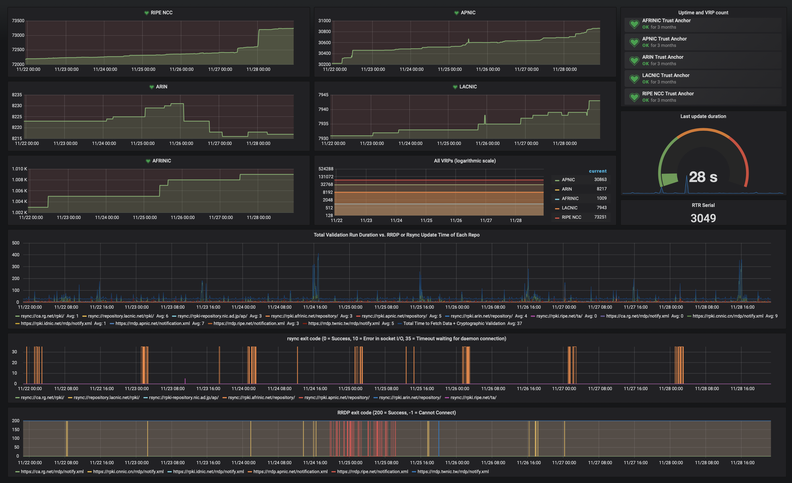

.. _doc_routinator_monitoring:

Monitoring
==========

The HTTP server in Routinator provides endpoints for monitoring the application.
To launch Routinator in server mode on 192.0.2.13 with RTR running on port 3323
and HTTP on 8323, use the following command:

.. code-block:: text

   routinator server --rtr 192.0.2.13:3323 --http 192.0.2.13:8323

The HTTP service has these monitoring endpoints on the following paths:

:command:`/version`
    Returns the version of the Routinator instance

:command:`/metrics`
    Exposes exhaustive time series data specifically for `Prometheus
    <https://prometheus.io/>`_, containing metrics on all trust anchors,
    repositories, RRDP and rsync connections, as well as RTR and HTTP sessions.
    If desired, dedicated `port 9556
    <https://github.com/prometheus/prometheus/wiki/Default-port-allocations>`_
    is allocated for the exporter.
     
:command:`/api/v1/status`
    Returns exhaustive information in JSON format on all trust anchors,
    repositories, RRDP and rsync connections, as well as RTR and HTTP sessions.
    This data set provides the source for the Routinator user interface.

:command:`/status`
    Returns a subset of the metrics information in a concise plain text format

Metrics
-------

Update metrics
  - When the last update started and finished
  - The total duration of the last update
  - The retrieval duration and `exit code <https://lxadm.com/Rsync_exit_codes>`_ for each rsync publication point
  - The retrieval duration and `HTTP status code <https://en.wikipedia.org/wiki/List_of_HTTP_status_codes>`_ for each RRDP publication point 

Object metrics
  - For each cryptographic object that can appear in the RPKI, the number of valid, invalid and stale items per trust anchor and repository
  - The number of validated ROA payloads (VRPs) per Trust Anchor and repository
  - The number of VRPs added and excluded locally

RTR server
  - The current RTR serial number
  - The current number of RTR connections
  - The total amount of bytes sent and received over the RTR connection
  - Metrics for each RTR client is available if the :option:`--rtr-client-metrics` option is provided
  
HTTP server
  - The current number of HTTP connections
  - The total amount of bytes sent and received over the HTTP connection
  - The number of HTTP requests

.. _doc_routinator_monitoring_json:

JSON
""""

At the :command:`/api/v1/status` endpoint the following JSON key value pairs
are available:

``version``
    The version of Routinator
    
``serial``
    The current :ref:`RTR <doc_routinator_rtr_service>` serial number
    
``now``
    The current date and time in UTC
    
``lastUpdateStart``
    The date and time time in UTC that the last validation run started
    
``lastUpdateDone``
    The date and time time in UTC that the last validation run completed
    
``lastUpdateDuration``
    The duration of the last validation run, in seconds
    
``tals``
    Metrics for each configured trust anchor. In most cases these will be the
    five Regional Internet Registries, but will include the trust anchors of
    any configured :ref:`testbeds <doc_routinator_testbed>` as well.
    
``vrpsTotal``
    The total number of Validated ROA Payloads (VRPs) found to be present and
    valid

``vrpsUnsafe``
    The number of VRPs that are considered :term:`unsafe <Unsafe VRPs>`

``vrpsLocallyFiltered``
    The number of VRPs that are filtered as the result of a 
    :ref:`local exception <doc_routinator_local_exceptions>`

``vrpsDuplicate``
    The number of duplicate VRPs resulting from ROAs containing the same 
    authorisation

``vrpsFinal``
    The number of VRPs that is considered the final set provided to your 
    routers. It is the total number of VRPs, minus the ones that are unsafe,
    locally filtered and duplicate.

``validPublicationPoints``
    The number of valid :term:`publication points <Publication Point>`

``rejectedPublicationPoints``
    The number of rejected :term:`publication points <Publication Point>`

``validManifests``
    The number of valid :term:`manifests <Manifest>`

``invalidManifests``
    The number of invalid :term:`manifests <Manifest>`

``staleManifests``
    The number of :term:`stale <Stale Object>` :term:`manifests <Manifest>`

``missingManifests``
    The number of missing :term:`manifests <Manifest>`

``validCRLs``
    The number of valid :term:`certificate revocation lists <Certificate 
    Revocation List (CRL)>`

``invalidCRLs``
    The number of invalid :term:`certificate revocation lists <Certificate 
    Revocation List (CRL)>`

``staleCRLs``
    The number of :term:`stale <Stale Object>` :term:`certificate revocation
    lists <Certificate  Revocation List (CRL)>`

``strayCRLs``
    The number of stray :term:`certificate revocation lists <Certificate 
    Revocation List (CRL)>`. This refers to a CRL listed on the manifest that is
    not also the CRL listed in the manifest’s EE certificate.

``validCACerts``
    The number of Certificate Authority certificates found to be present and
    valid

``validEECerts``
    The number of End Entity certificates found to be present and valid

``invalidCerts``
    The number of invalid certificates

``validROAs``
    The number of valid :term:`Route Origin Attestations <Route Origin 
    Attestation (ROA)>`

``invalidROAs``
    The number of invalid :term:`Route Origin Attestations <Route Origin 
    Attestation (ROA)>`

``validGBRs``
    The number of valid :term:`Ghostbusters Records <Ghostbusters Record (GBR)>`

``InvalidGBRs``
    The number of invalid :term:`Ghostbusters Records 
    <Ghostbusters Record (GBR)>`

``otherObjects``
    The number of objects found that are not certificates (.cer), certificate 
    revocation lists (.crl), manifests (.mft), ROAs (.roa), or Ghostbuster 
    Records (.gbr).

.. _doc_routinator_monitoring_prometheus:

Prometheus
""""""""""

At the :command:`/metrics` endpoint the following Prometheus metrics are 
available:

``routinator_{ta,repository}_valid_vrps_total``
    The total number of Validated ROA Payloads (VRPs) found to be present and
    valid. This metric is exposed for each trust anchor and repository
    
``routinator_{ta,repository}_invalid_vrps_total``
    The total number of Validated ROA Payloads (VRPs) found to be present and
    valid. This metric is exposed for each trust anchor and repository
        

.. _doc_routinator_monitoring_grafana:

Grafana
-------

Using the Prometheus endpoint it's possible to build a detailed dashboard using
for example `Grafana <https://grafana.com>`_. We provide a `template
<https://grafana.com/grafana/dashboards/11922>`_ to get started.

    A sample Grafana dashboard
